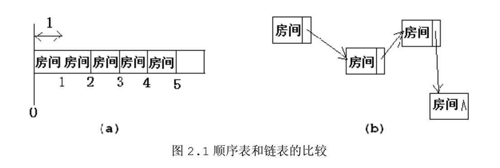

## 1、 集合和数据结构

分两部分来介绍，集合和数据结构。先说数据结构。


### 1.1 数据结构

**数据的逻辑结构**

数据的逻辑结构是对数据之间关系的描述，它与数据的存储结构无关，同一种逻辑结构可以有多种存储结构。主要有`线性结构`和`非线性结构`两大类。

**数据的物理结构**

数据的物理结构又称为存储结构，是数据的逻辑结构在计算机中的表示(又称映象)。

4种存储方法：**顺序存储方法、链式存储方法、索引存储方法和散列存储方法**。

#### 线性结构

**1.** **线性表的定义**

线性表是具有相同特性数据元素的一个有限序列。

**2.** **线性表的存储结构**

​ 线性表的存储结构有**顺序存储结构**和**链式存储结构**两种

顺序存储结构：



​ 

链式存储结构：单链表、双链表、循环单链表、循环単链表、循环双链表和静态链表。

**线性表的存储特性**

**(1)** **顺序存储结构特性**

- 随机访问特性

- 占用连续的存储空间

- 静态分配

- 插入删除操作需要移动多个元素

**(2)** **链式存储结构特性**

- 不支持随机访问

- 结点的存储空间利用率较之顺序表稍低一些

- 动态分配

- 插入删除操作不需要移动元素

#### 非线性结构

非线性结构，数学用语，其[逻辑](https://baike.baidu.com/item/%E9%80%BB%E8%BE%91/543?fromModule=lemma_inlink)特征是一个结点元素可能有多个直接前驱和多个直接后继。比较典型的就是树和图了。

树

**图**

```
一. 非线性结构的概述
二. 图的基本概念
    1. 定义
    2. 无向图、有向图
        2.1 无向图
        2.2 有向图
        2.3 简单图
        2.4 多重图
    3. 顶点的度、出度、入度
        3.1 对于无向图
        3.2 对于有向图
    4. 边的权、带权图 (网）
    5. 点到点的关系
        5.1 顶点与顶点之间的关系描述
        5.2 连通的、强连通的、连通图、强连通图
    6. 图的局部
        6.1 无向图子图、生成子图
        6.2 有向图子图、生成子图
        6.3 连通分量
        6.4 强连通分量
    7. 几种特殊形态的图
        7.1 生成树
        7.2 生成森林
        7.3 无向完全图和有向完全图
        7.4 稀疏图和稠密图
        7.5 生成树和有向树
三. 图的存储
    1. 邻接矩阵法
        1.1 定义
        1.2 邻接矩阵存储有向图和无向图
        1.3 邻接矩阵存储带权图（网）
        1.4 邻接矩阵法的性能分析
        1.5 邻接矩阵法的性质
    2. 邻接表法
        2.1 来源
        2.2 定义（采用顺序存储和链式存储结合）
        2.3 邻接表法的性质
        2.4 邻接表和邻接矩阵的比较
    3. 十字链表（只能存储有向图）
        3.1 来源
        3.2 定义
        3.3 十字链表法性能分析
    4. 邻接多重表（只能存储无向图）
        4.1 来源
        4.2 定义
        4.3 邻接多重表性能分析
    5. 四种存储结构的比较
四. 图的基本操作
五. 图的遍历
    1. 广度优先搜索（BFS遍历）
        1.1 概述
        1.2 复杂度分析
        1.3 广度优先生成树
    2. 深度优先搜索（DFS遍历）
        2.1 概述
        2.2 复杂度分析
        2.3 深度优先生成树
    3. 图的遍历和图的连通性
        3.1 对于无向图
        3.2 对于有向图
六. 图的应用
    1. 最小生成（代价）树
        1.1 概述
            1) 来源
            2) 定义
            3) 性质
        1.2 求最小生成树的两种算法
            1) Prim算法
            2) Kruskal算法
            3) 两个算法的比较
    2. 最短路径
        2.1 定义
        2.2 分类
            1）BFS求无权图的单源最短路径
            2）Dijkstra算法求单源最短路径
            3）Floyd算法求各顶点之间最短路径
        2.3 三种算法的比较
    3. 有向无环图描述表达式
        3.1 概述
        3.2 DAG描述表达式
        3.3 解题方法
    4. 拓扑排序
        4.1 AOV网
        4.2 拓扑排序概述
        4.3 拓扑排序常用方法
        4.4 拓扑排序复杂度
        4.5 逆拓扑排序
    5. 关键路径
        5.1 AOE网
        5.2 关键路径概述
        5.3 求关键路径的步骤
        5.4 关键路径的特性
```

### 1.2 集合

集合之 栈、队列和数组

**1.** **栈和队列的基本概念**

**1.1** **栈**

(1) 栈的定义

栈是一种只能在一端进行插入或者删除的线性表。

(2) 栈的特点

先进后出

(3) 栈的存储结构

顺序栈和链式栈。

**1.2** **队**

(1) 队列的定义

一种操作受限的线性表，只能在一端插入，另一端删除。

(2) 队列的特点

先进先出。

(3) 队列的存储结构

顺序队和链队。

容器主要包括 Collection 和 Map 两种，Collection 存储着对象的集合，而 Map 存储着键值对（两个对象）的映射表。

## java容器

<div align="center">  </div><br>

### 1. Set

- TreeSet：基于红黑树实现，支持有序性操作，例如根据一个范围查找元素的操作。但是查找效率不如 HashSet，HashSet 查找的时间复杂度为 O(1)，TreeSet 则为 O(logN)。

- HashSet：基于哈希表实现，支持快速查找，但不支持有序性操作。并且失去了元素的插入顺序信息，也就是说使用 Iterator 遍历 HashSet 得到的结果是不确定的。

- LinkedHashSet：具有 HashSet 的查找效率，并且内部使用双向链表维护元素的插入顺序。

### 2. List

- ArrayList：基于动态数组实现，支持随机访问。

- Vector：和 ArrayList 类似，但它是线程安全的。

- LinkedList：基于双向链表实现，只能顺序访问，但是可以快速地在链表中间插入和删除元素。不仅如此，LinkedList 还可以用作栈、队列和双向队列。

### 3. Queue

- LinkedList：可以用它来实现双向队列。

- PriorityQueue：基于堆结构实现，可以用它来实现优先队列。

## Map

<div align="center">  </div><br>

- TreeMap：基于红黑树实现。

- HashMap：基于哈希表实现。

- HashTable：和 HashMap 类似，但它是线程安全的，这意味着同一时刻多个线程同时写入 HashTable 不会导致数据不一致。它是遗留类，不应该去使用它，而是使用 ConcurrentHashMap 来支持线程安全，ConcurrentHashMap 的效率会更高，因为 ConcurrentHashMap 引入了分段锁。

- LinkedHashMap：使用双向链表来维护元素的顺序，顺序为插入顺序或者最近最少使用（LRU）顺序。

HashMap

为了便于理解，以下源码分析以 JDK 1.7 为主。

### 1. 存储结构

内部包含了一个 Entry 类型的数组 table。Entry 存储着键值对。它包含了四个字段，从 next 字段我们可以看出 Entry 是一个链表。即数组中的每个位置被当成一个桶，一个桶存放一个链表。HashMap 使用拉链法来解决冲突，同一个链表中存放哈希值和散列桶取模运算结果相同的 Entry。

<div align="center">  </div><br>

```java
transient Entry[] table;
```

```java
static class Entry<K,V> implements Map.Entry<K,V> {
    final K key;
    V value;
    Entry<K,V> next;
    int hash;

    Entry(int h, K k, V v, Entry<K,V> n) {
        value = v;
        next = n;
        key = k;
        hash = h;
    }

    public final K getKey() {
        return key;
    }

    public final V getValue() {
        return value;
    }

    public final V setValue(V newValue) {
        V oldValue = value;
        value = newValue;
        return oldValue;
    }

    public final boolean equals(Object o) {
        if (!(o instanceof Map.Entry))
            return false;
        Map.Entry e = (Map.Entry)o;
        Object k1 = getKey();
        Object k2 = e.getKey();
        if (k1 == k2 || (k1 != null && k1.equals(k2))) {
            Object v1 = getValue();
            Object v2 = e.getValue();
            if (v1 == v2 || (v1 != null && v1.equals(v2)))
                return true;
        }
        return false;
    }

    public final int hashCode() {
        return Objects.hashCode(getKey()) ^ Objects.hashCode(getValue());
    }

    public final String toString() {
        return getKey() + "=" + getValue();
    }
}
```


### 9. 与 Hashtable 的比较

- Hashtable 使用 synchronized 来进行同步。
- HashMap 可以插入键为 null 的 Entry。
- HashMap 的迭代器是 fail-fast 迭代器。
- HashMap 不能保证随着时间的推移 Map 中的元素次序是不变的。

## 2、 锁和多线程

分两部分来介绍，锁和多线程。

### 2.1 锁

从四个方面介绍：锁的分类、锁的优化、死锁解除、锁的实现方式。

锁优化

这里的锁优化主要是指 JVM 对 synchronized 的优化。

## 自旋锁

互斥同步进入阻塞状态的开销都很大，应该尽量避免。在许多应用中，共享数据的锁定状态只会持续很短的一段时间。自旋锁的思想是让一个线程在请求一个共享数据的锁时执行忙循环（自旋）一段时间，如果在这段时间内能获得锁，就可以避免进入阻塞状态。

自旋锁虽然能避免进入阻塞状态从而减少开销，但是它需要进行忙循环操作占用 CPU 时间，它只适用于共享数据的锁定状态很短的场景。

在 JDK 1.6 中引入了自适应的自旋锁。自适应意味着自旋的次数不再固定了，而是由前一次在同一个锁上的自旋次数及锁的拥有者的状态来决定。

## 锁消除

锁消除是指对于被检测出不可能存在竞争的共享数据的锁进行消除。

锁消除主要是通过逃逸分析来支持，如果堆上的共享数据不可能逃逸出去被其它线程访问到，那么就可以把它们当成私有数据对待，也就可以将它们的锁进行消除。

对于一些看起来没有加锁的代码，其实隐式的加了很多锁。例如下面的字符串拼接代码就隐式加了锁：

```java
public static String concatString(String s1, String s2, String s3) {
    return s1 + s2 + s3;
}
```

String 是一个不可变的类，编译器会对 String 的拼接自动优化。在 JDK 1.5 之前，会转化为 StringBuffer 对象的连续 append() 操作：

```java
public static String concatString(String s1, String s2, String s3) {
    StringBuffer sb = new StringBuffer();
    sb.append(s1);
    sb.append(s2);
    sb.append(s3);
    return sb.toString();
}
```

每个 append() 方法中都有一个同步块。虚拟机观察变量 sb，很快就会发现它的动态作用域被限制在 concatString() 方法内部。也就是说，sb 的所有引用永远不会逃逸到 concatString() 方法之外，其他线程无法访问到它，因此可以进行消除。

## 锁粗化

如果一系列的连续操作都对同一个对象反复加锁和解锁，频繁的加锁操作就会导致性能损耗。

上一节的示例代码中连续的 append() 方法就属于这类情况。如果虚拟机探测到由这样的一串零碎的操作都对同一个对象加锁，将会把加锁的范围扩展（粗化）到整个操作序列的外部。对于上一节的示例代码就是扩展到第一个 append() 操作之前直至最后一个 append() 操作之后，这样只需要加锁一次就可以了。

## 轻量级锁

JDK 1.6 引入了偏向锁和轻量级锁，从而让锁拥有了四个状态：无锁状态（unlocked）、偏向锁状态（biasble）、轻量级锁状态（lightweight locked）和重量级锁状态（inflated）。

以下是 HotSpot 虚拟机对象头的内存布局，这些数据被称为 Mark Word。其中 tag bits 对应了五个状态，这些状态在右侧的 state 表格中给出。除了 marked for gc 状态，其它四个状态已经在前面介绍过了。

<div align="center">  </div><br>

下图左侧是一个线程的虚拟机栈，其中有一部分称为 Lock Record 的区域，这是在轻量级锁运行过程创建的，用于存放锁对象的 Mark Word。而右侧就是一个锁对象，包含了 Mark Word 和其它信息。

<div align="center">  </div><br>

轻量级锁是相对于传统的重量级锁而言，它使用 CAS 操作来避免重量级锁使用互斥量的开销。对于绝大部分的锁，在整个同步周期内都是不存在竞争的，因此也就不需要都使用互斥量进行同步，可以先采用 CAS 操作进行同步，如果 CAS 失败了再改用互斥量进行同步。

当尝试获取一个锁对象时，如果锁对象标记为 0 01，说明锁对象的锁未锁定（unlocked）状态。此时虚拟机在当前线程的虚拟机栈中创建 Lock Record，然后使用 CAS 操作将对象的 Mark Word 更新为 Lock Record 指针。如果 CAS 操作成功了，那么线程就获取了该对象上的锁，并且对象的 Mark Word 的锁标记变为 00，表示该对象处于轻量级锁状态。

<div align="center">  </div><br>

如果 CAS 操作失败了，虚拟机首先会检查对象的 Mark Word 是否指向当前线程的虚拟机栈，如果是的话说明当前线程已经拥有了这个锁对象，那就可以直接进入同步块继续执行，否则说明这个锁对象已经被其他线程线程抢占了。如果有两条以上的线程争用同一个锁，那轻量级锁就不再有效，要膨胀为重量级锁。

## 偏向锁

偏向锁的思想是偏向于让第一个获取锁对象的线程，这个线程在之后获取该锁就不再需要进行同步操作，甚至连 CAS 操作也不再需要。

当锁对象第一次被线程获得的时候，进入偏向状态，标记为 1 01。同时使用 CAS 操作将线程 ID 记录到 Mark Word 中，如果 CAS 操作成功，这个线程以后每次进入这个锁相关的同步块就不需要再进行任何同步操作。

当有另外一个线程去尝试获取这个锁对象时，偏向状态就宣告结束，此时撤销偏向（Revoke Bias）后恢复到未锁定状态或者轻量级锁状态。

<div align="center">  </div><br>

- # 死锁的条件
1. **互斥条件**
   
   资源是独占的且排他使用，进程互斥使用资源，即任意时刻一个资源只能给一个进程使用，其他进程若申请一个资源，而该资源被另一进程占有时，则申请者等待直到资源被占有者释放。

2. **不可剥夺条件**
   
   进程所获得的资源在未使用完毕之前，不被其他进程强行剥夺，而只能由获得该资源的进程资源释放。

3. **请求和保持条件**
   
   进程每次申请它所需要的一部分资源，在申请新的资源的同时，继续占用已分配到的资源。

4. **循环等待条件**
   
   在发生死锁时必然存在一个进程等待队列{P1,P2,…,Pn},其中P1等待P2占有的资源，P2等待P3占有的资源，…，Pn等待P1占有的资源，形成一个进程等待环路，环路中每一个进程所占有的资源同时被另一个申请，也就是前一个进程占有后一个进程所深情地资源。

# 解决死锁

**死锁介绍**

死锁是指两个或两个以上的进程在执行过程中，由于竞争资源或者由于彼此通信而造成的一种阻塞的现象，若无外力作用，它们都将无法推进下去。此时称系统处于死锁状态或系统产生了死锁，这些永远在互相等待的进程称为死锁进程。

**解决死锁的4种基本方法**

1. **预防死锁**
   
   通过设置一些限制条件，去破坏产生死锁的四个必要条件之一。

2. **避免死锁**
   
   在资源分配过程中，使用某种方法避免系统进入不安全的状态，从而避免发生死锁，如银行家算法。
   
   > 死锁避免的限制：
   > 
   > - 必须事先声明每个进程请求的最大资源量
   > 
   > - 考虑的进程必须无关的，也就是说，它们执行的顺序必须没有任何同步要求的限制
   > 
   > - 分配的资源数目必须是固定的。
   > 
   > - 在占有资源时，进程不能退出

3. **检测死锁**
   
   允许死锁的发生，但是通过系统的检测之后，采取一些措施，将死锁清除掉。检测的具体实施可以维护两个资源矩阵，对可用资源和需要资源进行比较； 解除死锁的方式主要可以实施抢占剥夺；kill掉进程；回滚系统等。

4. **解除死锁**
   
   该方法与检测死锁配合使用。

# 锁的分类


### 1. 乐观锁 VS 悲观锁

乐观锁与悲观锁是一种广义上的概念，体现了看待线程同步的不同角度。在Java和数据库中都有此概念对应的实际应用。

先说概念。对于同一个数据的并发操作，悲观锁认为自己在使用数据的时候一定有别的线程来修改数据，因此在获取数据的时候会先加锁，确保数据不会被别的线程修改。Java中，synchronized关键字和Lock的实现类都是悲观锁。

而乐观锁认为自己在使用数据时不会有别的线程修改数据，所以不会添加锁，只是在更新数据的时候去判断之前有没有别的线程更新了这个数据。如果这个数据没有被更新，当前线程将自己修改的数据成功写入。如果数据已经被其他线程更新，则根据不同的实现方式执行不同的操作（例如报错或者自动重试）。

乐观锁在Java中是通过使用无锁编程来实现，最常采用的是CAS算法，Java原子类中的递增操作就通过CAS自旋实现的。

2. 自旋锁 VS 适应性自旋锁

在介绍自旋锁前，我们需要介绍一些前提知识来帮助大家明白自旋锁的概念。

阻塞或唤醒一个Java线程需要操作系统切换CPU状态来完成，这种状态转换需要耗费处理器时间。如果同步代码块中的内容过于简单，状态转换消耗的时间有可能比用户代码执行的时间还要长。

在许多场景中，同步资源的锁定时间很短，为了这一小段时间去切换线程，线程挂起和恢复现场的花费可能会让系统得不偿失。如果物理机器有多个处理器，能够让两个或以上的线程同时并行执行，我们就可以让后面那个请求锁的线程不放弃CPU的执行时间，看看持有锁的线程是否很快就会释放锁。

而为了让当前线程“稍等一下”，我们需让当前线程进行自旋，如果在自旋完成后前面锁定同步资源的线程已经释放了锁，那么当前线程就可以不必阻塞而是直接获取同步资源，从而避免切换线程的开销。这就是自旋锁。

自旋锁本身是有缺点的，它不能代替阻塞。自旋等待虽然避免了线程切换的开销，但它要占用处理器时间。如果锁被占用的时间很短，自旋等待的效果就会非常好。反之，如果锁被占用的时间很长，那么自旋的线程只会白浪费处理器资源。所以，自旋等待的时间必须要有一定的限度，如果自旋超过了限定次数（默认是10次，可以使用-XX:PreBlockSpin来更改）没有成功获得锁，就应当挂起线程。

自旋锁的实现原理同样也是CAS，AtomicInteger中调用unsafe进行自增操作的源码中的do-while循环就是一个自旋操作，如果修改数值失败则通过循环来执行自旋，直至修改成功。


自旋锁在JDK1.4.2中引入，使用-XX:+UseSpinning来开启。JDK 6中变为默认开启，并且引入了自适应的自旋锁（适应性自旋锁）。

自适应意味着自旋的时间（次数）不再固定，而是由前一次在同一个锁上的自旋时间及锁的拥有者的状态来决定。如果在同一个锁对象上，自旋等待刚刚成功获得过锁，并且持有锁的线程正在运行中，那么虚拟机就会认为这次自旋也是很有可能再次成功，进而它将允许自旋等待持续相对更长的时间。如果对于某个锁，自旋很少成功获得过，那在以后尝试获取这个锁时将可能省略掉自旋过程，直接阻塞线程，避免浪费处理器资源。

在自旋锁中 另有三种常见的锁形式:TicketLock、CLHlock和MCSlock，本文中仅做名词介绍，不做深入讲解，感兴趣的同学可以自行查阅相关资料。

### 3. 无锁 VS 偏向锁 VS 轻量级锁 VS 重量级锁

这四种锁是指锁的状态，专门针对synchronized的。在介绍这四种锁状态之前还需要介绍一些额外的知识。

首先为什么Synchronized能实现线程同步？

在回答这个问题之前我们需要了解两个重要的概念：“Java对象头”、“Monitor”。

#### Java对象头

synchronized是悲观锁，在操作同步资源之前需要给同步资源先加锁，这把锁就是存在Java对象头里的，而Java对象头又是什么呢？

我们以Hotspot虚拟机为例，Hotspot的对象头主要包括两部分数据：Mark Word（标记字段）、Klass Pointer（类型指针）。

**Mark Word**：默认存储对象的HashCode，分代年龄和锁标志位信息。这些信息都是与对象自身定义无关的数据，所以Mark Word被设计成一个非固定的数据结构以便在极小的空间内存存储尽量多的数据。它会根据对象的状态复用自己的存储空间，也就是说在运行期间Mark Word里存储的数据会随着锁标志位的变化而变化。

**Klass Point**：对象指向它的类元数据的指针，虚拟机通过这个指针来确定这个对象是哪个类的实例。

#### Monitor

Monitor可以理解为一个同步工具或一种同步机制，通常被描述为一个对象。每一个Java对象就有一把看不见的锁，称为内部锁或者Monitor锁。

Monitor是线程私有的数据结构，每一个线程都有一个可用monitor record列表，同时还有一个全局的可用列表。每一个被锁住的对象都会和一个monitor关联，同时monitor中有一个Owner字段存放拥有该锁的线程的唯一标识，表示该锁被这个线程占用。

现在话题回到synchronized，synchronized通过Monitor来实现线程同步，Monitor是依赖于底层的操作系统的Mutex Lock（互斥锁）来实现的线程同步。

如同我们在自旋锁中提到的“阻塞或唤醒一个Java线程需要操作系统切换CPU状态来完成，这种状态转换需要耗费处理器时间。如果同步代码块中的内容过于简单，状态转换消耗的时间有可能比用户代码执行的时间还要长”。这种方式就是synchronized最初实现同步的方式，这就是JDK 6之前synchronized效率低的原因。这种依赖于操作系统Mutex Lock所实现的锁我们称之为“重量级锁”，JDK 6中为了减少获得锁和释放锁带来的性能消耗，引入了“偏向锁”和“轻量级锁”。

所以目前锁一共有4种状态，级别从低到高依次是：无锁、偏向锁、轻量级锁和重量级锁。锁状态只能升级不能降级。

通过上面的介绍，我们对synchronized的加锁机制以及相关知识有了一个了解，那么下面我们给出四种锁状态对应的的Mark Word内容，然后再分别讲解四种锁状态的思路以及特点：

| 锁状态  | 存储内容                          | 存储内容 |
| ---- | ----------------------------- | ---- |
| 无锁   | 对象的hashCode、对象分代年龄、是否是偏向锁（0）  | 01   |
| 偏向锁  | 偏向线程ID、偏向时间戳、对象分代年龄、是否是偏向锁（1） | 01   |
| 轻量级锁 | 指向栈中锁记录的指针                    | 00   |
| 重量级锁 | 指向互斥量（重量级锁）的指针                | 10   |

**无锁**

无锁没有对资源进行锁定，所有的线程都能访问并修改同一个资源，但同时只有一个线程能修改成功。

无锁的特点就是修改操作在循环内进行，线程会不断的尝试修改共享资源。如果没有冲突就修改成功并退出，否则就会继续循环尝试。如果有多个线程修改同一个值，必定会有一个线程能修改成功，而其他修改失败的线程会不断重试直到修改成功。上面我们介绍的CAS原理及应用即是无锁的实现。无锁无法全面代替有锁，但无锁在某些场合下的性能是非常高的。

**偏向锁**

偏向锁是指一段同步代码一直被一个线程所访问，那么该线程会自动获取锁，降低获取锁的代价。

在大多数情况下，锁总是由同一线程多次获得，不存在多线程竞争，所以出现了偏向锁。其目标就是在只有一个线程执行同步代码块时能够提高性能。

当一个线程访问同步代码块并获取锁时，会在Mark Word里存储锁偏向的线程ID。在线程进入和退出同步块时不再通过CAS操作来加锁和解锁，而是检测Mark Word里是否存储着指向当前线程的偏向锁。引入偏向锁是为了在无多线程竞争的情况下尽量减少不必要的轻量级锁执行路径，因为轻量级锁的获取及释放依赖多次CAS原子指令，而偏向锁只需要在置换ThreadID的时候依赖一次CAS原子指令即可。

偏向锁只有遇到其他线程尝试竞争偏向锁时，持有偏向锁的线程才会释放锁，线程不会主动释放偏向锁。偏向锁的撤销，需要等待全局安全点（在这个时间点上没有字节码正在执行），它会首先暂停拥有偏向锁的线程，判断锁对象是否处于被锁定状态。撤销偏向锁后恢复到无锁（标志位为“01”）或轻量级锁（标志位为“00”）的状态。

偏向锁在JDK 6及以后的JVM里是默认启用的。可以通过JVM参数关闭偏向锁：-XX:-UseBiasedLocking=false，关闭之后程序默认会进入轻量级锁状态。

**轻量级锁**

是指当锁是偏向锁的时候，被另外的线程所访问，偏向锁就会升级为轻量级锁，其他线程会通过自旋的形式尝试获取锁，不会阻塞，从而提高性能。

在代码进入同步块的时候，如果同步对象锁状态为无锁状态（锁标志位为“01”状态，是否为偏向锁为“0”），虚拟机首先将在当前线程的栈帧中建立一个名为锁记录（Lock Record）的空间，用于存储锁对象目前的Mark Word的拷贝，然后拷贝对象头中的Mark Word复制到锁记录中。

拷贝成功后，虚拟机将使用CAS操作尝试将对象的Mark Word更新为指向Lock Record的指针，并将Lock Record里的owner指针指向对象的Mark Word。

如果这个更新动作成功了，那么这个线程就拥有了该对象的锁，并且对象Mark Word的锁标志位设置为“00”，表示此对象处于轻量级锁定状态。

如果轻量级锁的更新操作失败了，虚拟机首先会检查对象的Mark Word是否指向当前线程的栈帧，如果是就说明当前线程已经拥有了这个对象的锁，那就可以直接进入同步块继续执行，否则说明多个线程竞争锁。

若当前只有一个等待线程，则该线程通过自旋进行等待。但是当自旋超过一定的次数，或者一个线程在持有锁，一个在自旋，又有第三个来访时，轻量级锁升级为重量级锁。

**重量级锁**

升级为重量级锁时，锁标志的状态值变为“10”，此时Mark Word中存储的是指向重量级锁的指针，此时等待锁的线程都会进入阻塞状态。

整体的锁状态升级流程如下：


综上，偏向锁通过对比Mark Word解决加锁问题，避免执行CAS操作。而轻量级锁是通过用CAS操作和自旋来解决加锁问题，避免线程阻塞和唤醒而影响性能。重量级锁是将除了拥有锁的线程以外的线程都阻塞。

### 2.2 多线程

从线程的状态、线程的实现、线程的安全

线程状态

一个线程只能处于一种状态，并且这里的线程状态特指 Java 虚拟机的线程状态，不能反映线程在特定操作系统下的状态。

## 新建（NEW）

创建后尚未启动。

## 可运行（RUNABLE）

正在 Java 虚拟机中运行。但是在操作系统层面，它可能处于运行状态，也可能等待资源调度（例如处理器资源），资源调度完成就进入运行状态。所以该状态的可运行是指可以被运行，具体有没有运行要看底层操作系统的资源调度。

## 阻塞（BLOCKED）

请求获取 monitor lock 从而进入 synchronized 函数或者代码块，但是其它线程已经占用了该 monitor lock，所以出于阻塞状态。要结束该状态进入从而 RUNABLE 需要其他线程释放 monitor lock。

## 无限期等待（WAITING）

等待其它线程显式地唤醒。

阻塞和等待的区别在于，阻塞是被动的，它是在等待获取 monitor lock。而等待是主动的，通过调用 Object.wait() 等方法进入。

| 进入方法                              | 退出方法                                 |
| --------------------------------- | ------------------------------------ |
| 没有设置 Timeout 参数的 Object.wait() 方法 | Object.notify() / Object.notifyAll() |
| 没有设置 Timeout 参数的 Thread.join() 方法 | 被调用的线程执行完毕                           |
| LockSupport.park() 方法             | LockSupport.unpark(Thread)           |

## 限期等待（TIMED_WAITING）

无需等待其它线程显式地唤醒，在一定时间之后会被系统自动唤醒。

| 进入方法                             | 退出方法                                        |
| -------------------------------- | ------------------------------------------- |
| Thread.sleep() 方法                | 时间结束                                        |
| 设置了 Timeout 参数的 Object.wait() 方法 | 时间结束 / Object.notify() / Object.notifyAll() |
| 设置了 Timeout 参数的 Thread.join() 方法 | 时间结束 / 被调用的线程执行完毕                           |
| LockSupport.parkNanos() 方法       | LockSupport.unpark(Thread)                  |
| LockSupport.parkUntil() 方法       | LockSupport.unpark(Thread)                  |

调用 Thread.sleep() 方法使线程进入限期等待状态时，常常用“使一个线程睡眠”进行描述。调用 Object.wait() 方法使线程进入限期等待或者无限期等待时，常常用“挂起一个线程”进行描述。睡眠和挂起是用来描述行为，而阻塞和等待用来描述状态。

## 死亡（TERMINATED）

可以是线程结束任务之后自己结束，或者产生了异常而结束。

**使用线程**

有三种使用线程的方法：

- 实现 Runnable 接口；
- 实现 Callable 接口；
- 继承 Thread 类。

实现 Runnable 和 Callable 接口的类只能当做一个可以在线程中运行的任务，不是真正意义上的线程，因此最后还需要通过 Thread 来调用。可以理解为任务是通过线程驱动从而执行的。

实现接口 VS 继承 Thread

实现接口会更好一些，因为：

- Java 不支持多重继承，因此继承了 Thread 类就无法继承其它类，但是可以实现多个接口；
- 类可能只要求可执行就行，继承整个 Thread 类开销过大。

**进程、线程和协程**

## 进程

一个在内存中运行的应用程序。每个进程都有自己独立的一块内存空间，一个进程可以有多个线程，比如在Windows系统中，一个运行的xx.exe就是一个进程。

进程，直观点说，保存在硬盘上的程序运行以后，会在内存空间里形成一个独立的内存体，这个内存体**有自己独立的地址空间，有自己的堆**，上级挂靠单位是操作系统。**操作系统会以进程为单位，分配系统资源（CPU时间片、内存等资源），进程是资源分配的最小单位**。

进程间通信（IPC）：

- 管道(Pipe)、命名管道(FIFO)、消息队列(Message Queue) 、信号量(Semaphore) 、共享内存（Shared Memory）；套接字（Socket）。

## 线程

进程中的一个执行任务（控制单元），负责当前进程中程序的执行。一个进程至少有一个线程，一个进程可以运行多个线程，多个线程可共享数据。

与进程不同的是同类的多个线程共享进程的**堆**和**方法区**资源，但每个线程有自己的**程序计数器**、**虚拟机栈**和**本地方法栈**，所以系统在产生一个线程，或是在各个线程之间作切换工作时，负担要比进程小得多，也正因为如此，线程也被称为轻量级进程。

## 协程

**协程是一种用户态的轻量级线程，**协程的调度完全由用户控制。协程拥有自己的寄存器上下文和栈。协程调度切换时，将寄存器上下文和栈保存到其他地方，在切回来的时候，恢复先前保存的寄存器上下文和栈，直接操作栈则基本没有内核切换的开销，可以不加锁的访问全局变量，所以上下文的切换非常快。


协程，是一种比线程更加轻量级的存在，协程不是被操作系统内核所管理，而完全是由程序所控制（也就是在用户态执行）。这样带来的好处就是性能得到了很大的提升，不会像线程切换那样消耗资源。

  子程序，或者称为函数，在所有语言中都是层级调用，比如A调用B，B在执行过程中又调用了C，C执行完毕返回，B执行完毕返回，最后是A执行完毕。所以子程序调用是通过栈实现的，**一个线程就是执行一个子程序**。子程序调用总是一个入口，一次返回，调用顺序是明确的。而协程的调用和子程序不同。

**协程在子程序内部是可中断的，然后转而执行别的子程序，在适当的时候再返回来接着执行**。

```python
def A():
    print '1'
    print '2'
    print '3'

def B():
    print 'x'
    print 'y'
    print 'z'
```

假设由协程执行，在执行A的过程中，可以随时中断，去执行B，B也可能在执行过程中中断再去执行A，结果可能是：`1 2 x y 3 z`。

  协程的特点在于是一个线程执行，那和多线程比，协程有何优势？

- **极高的执行效率**：因为**子程序切换不是线程切换，而是由程序自身控制**，因此，**没有线程切换的开销**，和多线程比，线程数量越多，协程的性能优势就越明显；
- **不需要多线程的锁机制**：因为只有一个线程，也不存在同时写变量冲突，**在协程中控制共享资源不加锁**，只需要判断状态就好了，所以执行效率比多线程高很多。

## 进程与线程的区别

线程具有许多传统进程所具有的特征，故又称为轻型进程(Light—Weight Process)或进程元；而把传统的进程称为重型进程(Heavy—Weight Process)，它相当于只有一个线程的任务。在引入了线程的操作系统中，通常一个进程都有若干个线程，至少包含一个线程。

**根本区别**：进程是操作系统资源分配的基本单位，而线程是处理器任务调度和执行的基本单位

**资源开销**：每个进程都有独立的代码和数据空间（程序上下文），程序之间的切换会有较大的开销；线程可以看做轻量级的进程，同一类线程共享代码和数据空间，每个线程都有自己独立的运行栈和程序计数器（PC），线程之间切换的开销小。

**包含关系**：如果一个进程内有多个线程，则执行过程不是一条线的，而是多条线（线程）共同完成的；线程是进程的一部分，所以线程也被称为轻权进程或者轻量级进程。

**内存分配**：同一进程的线程共享本进程的地址空间和资源，而进程之间的地址空间和资源是相互独立的

**影响关系**：一个进程崩溃后，在保护模式下不会对其他进程产生影响，但是一个线程崩溃整个进程都死掉。所以多进程要比多线程健壮。

**执行过程**：每个独立的进程有程序运行的入口、顺序执行序列和程序出口。但是线程不能独立执行，必须依存在应用程序中，由应用程序提供多个线程执行控制，两者均可并发执行

## 协程与线程的区别

1. 一个线程可以多个协程，一个进程也可以单独拥有多个协程。

2. 线程进程都是同步机制，而协程则是异步。

3. 协程能保留上一次调用时的状态，每次过程重入时，就相当于进入上一次调用的状态。

4）线程是抢占式，而协程是非抢占式的，所以需要用户自己释放使用权来切换到其他协程，因此同一时间其实只有一个协程拥有运行权，相当于单线程的能力。

5）协程并不是取代线程, 而且抽象于线程之上, 线程是被分割的CPU资源, 协程是组织好的代码流程, 协程需要线程来承载运行, 线程是协程的资源, 但协程不会直接使用线程, 协程直接利用的是执行器(Interceptor), 执行器可以关联任意线程或线程池, 可以使当前线程, UI线程, 或新建新程。

6）线程是协程的资源。协程通过Interceptor来间接使用线程这个资源。

## 3、 JVM和操作系统

分两部分来介绍，jvm和操作系统。

### 3.1 JVM

本节介绍java虚拟机相关的内容。

# 一、运行时数据区域

<div align="center">  </div><br>

## 程序计数器

记录正在执行的虚拟机字节码指令的地址（如果正在执行的是本地方法则为空）。

## Java 虚拟机栈

每个 Java 方法在执行的同时会创建一个栈帧用于存储局部变量表、操作数栈、常量池引用等信息。从方法调用直至执行完成的过程，对应着一个栈帧在 Java 虚拟机栈中入栈和出栈的过程。

<div align="center">  </div><br>

可以通过 -Xss 这个虚拟机参数来指定每个线程的 Java 虚拟机栈内存大小，在 JDK 1.4 中默认为 256K，而在 JDK 1.5+ 默认为 1M：

```java
java -Xss2M HackTheJava
```

该区域可能抛出以下异常：

- 当线程请求的栈深度超过最大值，会抛出 StackOverflowError 异常；
- 栈进行动态扩展时如果无法申请到足够内存，会抛出 OutOfMemoryError 异常。

## 本地方法栈

本地方法栈与 Java 虚拟机栈类似，它们之间的区别只不过是本地方法栈为本地方法服务。

本地方法一般是用其它语言（C、C++ 或汇编语言等）编写的，并且被编译为基于本机硬件和操作系统的程序，对待这些方法需要特别处理。

<div align="center">  </div><br>

## 堆

所有对象都在这里分配内存，是垃圾收集的主要区域（"GC 堆"）。

现代的垃圾收集器基本都是采用分代收集算法，其主要的思想是针对不同类型的对象采取不同的垃圾回收算法。可以将堆分成两块：

- 新生代（Young Generation）
- 老年代（Old Generation）

堆不需要连续内存，并且可以动态增加其内存，增加失败会抛出 OutOfMemoryError 异常。

可以通过 -Xms 和 -Xmx 这两个虚拟机参数来指定一个程序的堆内存大小，第一个参数设置初始值，第二个参数设置最大值。

```java
java -Xms1M -Xmx2M HackTheJava
```

## 方法区

用于存放已被加载的类信息、常量、静态变量、即时编译器编译后的代码等数据。

和堆一样不需要连续的内存，并且可以动态扩展，动态扩展失败一样会抛出 OutOfMemoryError 异常。

对这块区域进行垃圾回收的主要目标是对常量池的回收和对类的卸载，但是一般比较难实现。

HotSpot 虚拟机把它当成永久代来进行垃圾回收。但很难确定永久代的大小，因为它受到很多因素影响，并且每次 Full GC 之后永久代的大小都会改变，所以经常会抛出 OutOfMemoryError 异常。为了更容易管理方法区，从 JDK 1.8 开始，移除永久代，并把方法区移至元空间，它位于本地内存中，而不是虚拟机内存中。

方法区是一个 JVM 规范，永久代与元空间都是其一种实现方式。在 JDK 1.8 之后，原来永久代的数据被分到了堆和元空间中。元空间存储类的元信息，静态变量和常量池等放入堆中。

## 运行时常量池

运行时常量池是方法区的一部分。

Class 文件中的常量池（编译器生成的字面量和符号引用）会在类加载后被放入这个区域。

除了在编译期生成的常量，还允许动态生成，例如 String 类的 intern()。

## 直接内存

在 JDK 1.4 中新引入了 NIO 类，它可以使用 Native 函数库直接分配堆外内存，然后通过 Java 堆里的 DirectByteBuffer 对象作为这块内存的引用进行操作。这样能在一些场景中显著提高性能，因为避免了在堆内存和堆外内存来回拷贝数据。

### 3.2 零拷贝

零拷贝（Zero-Copy）是一种 I/O 操作优化技术，可以快速高效地将数据从文件系统移动到网络接口，而不需要将其从内核空间复制到用户空间。其在 FTP 或者 HTTP 等协议中可以显著地提升性能。但是需要注意的是，并不是所有的操作系统都支持这一特性，目前只有在使用 NIO 和 Epoll 传输时才可使用该特性。

需要注意，它不能用于实现了数据加密或者压缩的文件系统上，只有传输文件的原始内容。这类原始内容也包括加密了的文件内容。

### 3.3 IO模型

一、I/O 模型

一个输入操作通常包括两个阶段：

- 等待数据准备好
- 从内核向进程复制数据

对于一个套接字上的输入操作，第一步通常涉及等待数据从网络中到达。当所等待数据到达时，它被复制到内核中的某个缓冲区。第二步就是把数据从内核缓冲区复制到应用进程缓冲区。

Unix 有五种 I/O 模型：

- 阻塞式 I/O
- 非阻塞式 I/O
- I/O 复用（select 和 poll）
- 信号驱动式 I/O（SIGIO）
- 异步 I/O（AIO）

## 4 、数据库和索引

### 4.1 数据库

负数的移位运算相对于正数来说就有些难度了，难度在哪里呢？
当然是`负数的二进制表示`及`十进制的转化`

```java
例：-12 << 2
1、首先转化为二进制，-12的二进制为1111 0100
2、将二进制数向左移两位，低位补0，得到1101 0000
3、最后将二进制数转化成十进制数，1101 0000转化为十进制为-48
所以，-12 << 2 = -48
12345 
```

> 按二进制形式把所有的数字向右移动对应位移位数，低位移出(舍弃)，高位的空位补`符号位`，即正数补0，负数补1。

#### 正数

```java
例：20 >> 2
1、首先转化为二进制，20的二进制为0001 0100
2、将二进制数向右移两位，高位补符号位（0），得到0000 0101
3、最后将二进制数转化成十进制数，0000 0101转化为十进制为5
所以，20 >> 2 = 5
12345
```


## 优化

**硬件层面**

网络、磁盘IO、CPU层面

跨IDC、跨服务商层面优化

**软件层面**

1：小数据量数据库优化：sql索引（查询类型、扫描行数、是否使用索引）、改变查询方式。

2：redis 热点数据缓存优化

3：分库分表

4：业务拆分、减少复杂度、减少表的关联


## 运维平台从0到1

## k8s集群搭建


## 节点规划

### 软件版本

- 操作系统版本：centos7.9
- kubesphere: v3.1.1
- KubeKey 版本：v1.1.1
- Kubernetes 版本：v1.20.4
- Docker 版本：v19.03.15

### 规划说明

- K8s 集群规划
  
  - 负载均衡
    - 2 节点，HAProxy，使用 keepalived 实现高可用
  - Master 节点：3 节点，部署 KubeSphere 和 K8s 的管理组件，etcd 等服务
    - **本方案并没有把 etcd 单独部署，有条件或是规模较大的场景可以单独部署 etcd**
  - Worker 节点：6 节点，部署应用，根据实际需求决定数量

- 存储集群
  
  - 3 节点，GlusterFS
  - 每个节点 1T 数据盘

- 中间件集群
  
  - 在 K8s 集群之外，独立部署的常见中间件
  - nginx 代理节点，使用 keepalived 实现高可用，不采用 Ingress
  - MySQL 数据库，主从架构，中小规模使用，大规模需要专业运维人员或是使用云上成熟的产品，最好使用云服务商的产品
  - Ansible，单独的自动化运维管理节点，执行日常批量运维管理操作
  - Gitlab，运维代码管理，实现 Gitops
  - Harbor，镜像仓库
  - Elasticsearch，3 节点，存储日志
  - Prometheus，单独部署，用于 K8s 集群和 pod 的监控
  - Redis 集群，3 节点哨兵模式，该集群暂时还是部署在 K8s 上，后期考虑单独部署，因此预先规划预留机器，建议考虑云服务商的产品
  - RocketMQ 集群，3 节点，该集群暂时还是部署在 K8s 上，后期考虑单独部署，因此预先规划预留机器，建议考虑云服务上的产品

- 网络规划：我们网络要求比较多。因此，不同功能模块，规划了不同的网段，各位可根据需求合理规划
  
  | 功能域    | 网段              | 说明                     |
  | ------ | --------------- | ---------------------- |
  | K8s 集群 | 192.168.9.0/24  | K8s 集群内部节点使用           |
  | 存储集群   | 192.168.10.0/24 | 存储集群内部节点使用             |
  | 中间件集群  | 192.168.11.0/24 | 独立在 K8s 集群外的，各种中间件节点使用 |

#### 存储选型说明：

1. 候选者
   
   | 存储方案      | 优点             | 缺点                     | 说明                                             |
   | --------- | -------------- | ---------------------- | ---------------------------------------------- |
   | Ceph      | 资源多            | 没有 Ceph 集群故障处理能力，最好不要碰 | 曾经，经历过 3 副本全部损坏数据丢失的惨痛经历，因此没有能力处理各种故障之前不会再轻易选择 |
   | GlusterFS | 部署、维护简单；多副本高可用 | 资料少                    | 部署和维护简单，出了问题找回数据的可能性大一些                        |
   | NFS       | 使用广泛           | 单点、网络抖动                | 据说生产环境用的很多，但是单点和网络抖动风险，隐患不小，暂不考虑               |
   | MinIO     |                |                        | 官宣全球领先的对象存储先锋，还未实践                             |
   | Longhorn  |                |                        | 官宣企业级云原生容器存储解决方案，还未实践                          |

2. 入选者 (第一季)
   
   **GlusterFS**

3. 说明
   
   - 以上方案为初期初选，属于摸着石头过河，选一个先用着，后期根据运行情况再重新调整。
   - 大家请根据自己的存储需求和团队运维能力选择适合的方案。
   - 因为我们的业务场景对于持久化存储的需求也就是存放一些 log 日志，能承受一定的数据损失，因此综合选择了 GlusterFS。
   - 存储规划中假设 1T 数据满足需求，没考虑扩容，后续会做补充。

### K8s 集群节点规划

| 节点角色   | 主机名          | CPU(核) | 内存 (GB) | 系统盘 (GB) | 数据盘 (GB) | IP                      | 备注            |
| ------ | ------------ | ------ | ------- | -------- | -------- | ----------------------- | ------------- |
| 负载均衡   | k8s-slb-0    | 2      | 4       | 50       |          | 192.168.9.2/192.168.9.1 |               |
| 负载均衡   | k8s-slb-1    | 2      | 4       | 50       |          | 192.168.9.3/192.168.9.1 |               |
| Master | k8s-master-0 | 8      | 32      | 50       | 500      | 192.168.9.4             |               |
| Master | k8s-master-1 | 8      | 32      | 50       | 500      | 192.168.9.5             |               |
| Master | k8s-master-2 | 8      | 32      | 50       | 500      | 192.168.9.6             |               |
| Worker | k8s-node-0   | 8      | 32      | 50       | 500      | 192.168.9.7             |               |
| Worker | k8s-node-1   | 8      | 32      | 50       | 500      | 192.168.9.8             |               |
| Worker | k8s-node-2   | 8      | 32      | 50       | 500      | 192.168.9.9             |               |
| Worker | k8s-node-3   | 8      | 32      | 50       | 500      | 192.168.9.10            |               |
| Worker | k8s-node-4   | 8      | 32      | 50       | 500      | 192.168.9.11            |               |
| Worker | k8s-node-5   | 8      | 32      | 50       | 500      | 192.168.9.12            |               |
| Worker | k8s-node-n   | 8      | 32      | 50       | 500      | ...                     | 根据自己的业务需求增加节点 |

### 存储集群节点规划

| 节点角色 | 主机名              | CPU(核) | 内存 (GB) | 系统盘 (GB) | 数据盘 (GB) | IP           | 备注  |
| ---- | ---------------- | ------ | ------- | -------- | -------- | ------------ | --- |
| 存储节点 | glusterfs-node-0 | 4      | 16      | 50       | 1000     | 192.168.10.1 |     |
| 存储节点 | glusterfs-node-1 | 4      | 16      | 50       | 1000     | 192.168.10.2 |     |
| 存储节点 | glusterfs-node-2 | 4      | 16      | 50       | 1000     | 192.168.10.3 |     |

### 中间件节点规划

| 节点角色          | 主机名        | CPU(核) | 内存 (GB) | 系统盘 (GB) | 数据盘 (GB) | IP                        | 备注                 |
| ------------- | ---------- | ------ | ------- | -------- | -------- | ------------------------- | ------------------ |
| nginx 代理      | nginx-0    | 4      | 16      | 50       |          | 192.168.11.2/192.168.11.1 | 自建域名网关，不采用 Ingress |
| nginx 代理      | nginx-1    | 4      | 16      | 50       |          | 192.168.11.3/192.168.11.1 | 自建域名网关，不采用 Ingress |
| MySQL-主       | db-master  | 4      | 16      | 50       | 500      | 192.168.11.4              |                    |
| MySQL-从       | db-slave   | 4      | 16      | 50       | 500      | 192.168.11.5              |                    |
| Elasticsearch | elastic-0  | 4      | 16      | 50       | 1000     | 192.168.11.6              |                    |
| Elasticsearch | elastic-1  | 4      | 16      | 50       | 1000     | 192.168.11.7              |                    |
| Elasticsearch | elastic-2  | 4      | 16      | 50       | 1000     | 192.168.11.8              |                    |
| 自动化运维         | ansible    | 2      | 4       | 50       |          | 192.168.11.9              | 安装 ansible，用于自动化运维 |
| 配置管理          | harbor     | 4      | 16      | 50       | 500      | 192.168.11.10             | 安装 gitlab 和 harbor |
| Prometheus    | monitor    | 4      | 16      | 50       | 500      | 192.168.11.11             |                    |
| Redis         | redis-0    | 4      | 16      | 50       | 200      | 192.168.11.12             | 预留                 |
| Redis         | redis-1    | 4      | 16      | 50       | 200      | 192.168.11.13             | 预留                 |
| Redis         | redis-2    | 4      | 16      | 50       | 200      | 192.168.11.14             | 预留                 |
| RocketMQ      | rocketmq-0 | 4      | 16      | 50       | 200      | 192.168.11.15             | 预留                 |
| RocketMQ      | rocketmq-1 | 4      | 16      | 50       | 200      | 192.168.11.16             | 预留                 |
| RocketMQ      | rocketmq-2 | 4      | 16      | 50       | 200      | 192.168.11.17             | 预留                 |


## 算法平台从0到1

**1、标注平台建设**

智能标注是一款智能化数据标注的平台，支持图像、文本、视频、音频等多种数据类型的标注，以及多模态的混合标注。适用于互联网/工业/制造业等等对数据标注有需求的客户。图像、文本、视频、音频及多模态的标注，用于图像检测、文本主体词识别、视频实体识别、音频分割等多种深度学习和机器学习模型训练场景的客户。智能标注提供了丰富的标注内容组件和题目组件，用户既可以直接使用平台预置的标注模板，也可以根据自己的场景自定义模板。同时提供`OCR`智能识别和`ASR`语音智能识别的智能标注工具，可以极大提升标注过程的标注效率，从而降低人力成本。

**2、可视化建模平台**

可视化建模平台面向企业及开发者，提供轻量化、高性价比的云原生机器学习平台，涵盖可视化建模平台、云原生交互式建模平台、智能标注平台，支持千亿特征、万亿样本规模加速训练，百余落地场景，全面提升工程效率。支持大规模分布式的传统机器学习、深度学习、强化学习训练；支持流批一体训练；封装上百种机器学习算法，拖拽式建模，自动调参，无编程玩转人工智能。为开发者提供可视化的机器学习实验开发环境，帮助用户实现零代码开发人工智能相关服务。内置数百个成熟的机器学习算法，覆盖商品推荐、金融风控、广告预测等场景。总结为如下四大特征。

> **丰富的算法组件**
> 
> 涵盖大部分经典机器学习算法，包含回归、分类、聚类、文本分析等共200余个算法组件
> 
> **流批一体化训练**
> 
> 支持流批一体化的模型训练，可以做到离线环境训练基础模型，在线环境实时更新模型，大大增强模型对于实时数据的感知能力
> 
> **AutoML功能**
> 
> AutoML自动调参引擎内置多种调参方法，可以帮助算法从海量参数中快速查询到最优组合
> 
> **可视化开发体验**
> 
> 无需开发代码，可以通过拖拉拽的形式快速搭建机器学习实验

**3、云原生交互式建模平台**

云原生交互式建模平台提供了灵活开放的交互式云端机器开发环境，内置`JupyterLab`、`WebIDE`及`Terminal`，适合不同业务场景及客户需求。开箱即用的开发建模环境，降低用户运维成本的同时，开放底层`Sudo`权限，给客户提供最大化定制化能力，是为算法开发者量身打造的云端深度学习开发环。集成`JupyterLab`，插件化深度定制化开发，无需任何运维配置，沉浸式体验`Notebook`编写、调试及运行`Python`代码。