## 一、算法平台从0到1

------

### 知识图谱构建

**1、描述**

​		知识图谱的构建技术主要涉及命名实体识别和关系抽取两项至关重要的技术。其中，命名实体识别技术是一种从自然文本中辨别出命名性指称项的自然语言处理技术，如从句子“中国很大”中识别出“中国”。关系抽取的主要功能是预测实体和实体间的关系，是知识图谱构建任务中的关键技术之一，同时它也是智能搜索、问答系统等许多自然语言处理应用的重要技术之一，关系抽取一般情况下又可以划分为两部分，即实体抽取部分和实体间的关系抽取部分。

**2、职责**

​		负责命名实体识别技术和关系抽取部分的算法编写，及实体识别技术的论文编写。

**3、方法**

**命名实体识别技术**

​		由于开放领域的中文训练语料匮乏、语义歧义性大等特性，导致中文命名实体识别任务困难重重。但是，随着互联网的高速发展，大量的可实验的数据被积累下来了，为中文命名实体识别的研究创造了数据支撑的条件。早期的命名实体识别的算法大多数都是基于规则的算法，然而，随着数据规模的增加和对领域专家的要求使基于规则的算法停滞不前。随着机器学习和深度学习的发展，基于神经网络的命名实体识别研究成为了一大热点，其中，基于神经网络的BiLSTM-CRF模型就取得了较高的性能。在此基础上，提出一种基于集成学习的命名实体识别算法，经实验表明，相对于单模型的命名实体识别，提出的实体识别任务算法识别的准确率更高。

​														表1-1 命名实体识别算法实验结果

| **模型**         | **P(%)**  | **R(%)**  | **F1(%)** |
| ---------------- | --------- | --------- | --------- |
| BiLSTM-CRF       | 85.67     | 81.36     | 83.46     |
| GRU-CRF          | 86.06     | 84.92     | 85.49     |
| CASCADED HMM     | 80.32     | 79.45     | 79.88     |
| **本文集成模型** | **90.02** | **88.27** | **89.14** |

 **关系抽取技术**

​		关系抽取算法对标注实例存在着数量上的巨大需求，如果我们手工标注实例的话，不难想象这几乎是不可能完成的任务。在这样的背景条件下，远程监督关系抽取算法因此应运而生。但是，远程监督关系抽取技术并不是完美无缺的，因为该技术始终无法摆脱噪声数据的影响。因此，为了抑制噪声，大量研究人员开始尝试利用注意力机制对含有噪声的句子集合进行处理，通过赋予权重以选择出有效的训练样本，减少噪声的影响。但是，本文认为在所有样本中只选择出一个最佳样本并不是最优的选择策略。为了增加模型的鲁棒性，我们应该把假正例放在负例集合中，而不是做简单的移除操作。为了减少使用远程监督技术带来的数据噪声的影响，提出一种基于强化学习的关系抽取算法，利用深度强化学习的学习能力，构建一个纯净低噪的远程监督训练数据集。

​		通过AUC(Area Under Curve)来评价关系抽取性能的优劣，AUC的值可由ROC曲线下各部分的面积求和得到，是衡量学习器优劣的一种性能指标。如表1-2所示，三个模型都在attention机制下取得了最佳性能，其中PCNN模型取得最高成绩，AUC指标为78.23%。因此，我们选择PCNN模型并结合本文提出的强化学习的策略进行实验，实验结果如表1-3所示，同样在attention机制下，该PCNN_RL模型取得了82.26%的AUC指标成绩，领先于其他模型，这说明本文提出的基于远程监督和attention机制的强化学习模型具有更好的性能。

​														表1-2 关系抽取AUC实验结果

| Model | Attention(%) | Maximum(%) | Average(%) |
| ----- | ------------ | ---------- | ---------- |
| PCNN  | 78.23        | 76.13      | 75.24      |
| CNN   | 69.26        | 67.12      | 66.56      |
| BIRNN | 50.13        | 48.23      | 44.17      |

 													表1-3 基于强化学习的关系抽取AUC实验结果

| Model | Performance(%) | Pooling   |
| ----- | -------------- | --------- |
| PCNN  | 82.26          | attention |
| BIRNN | 52.92          | attention |
| CNN   | 75.12          | attention |

### 知识图谱问答

**1、描述**

​		针对知识图谱问答技术的研究，早期的研究方法集中在使用语义解析的方法，该方法通过将自然语言文本的问句转化为等价的逻辑表达式，基于一定的逻辑规则实现对知识库的查询。随后，信息检索方法被提出并应用于知识图谱问答技术中，与语义解析方法的不同之处在于它将问句转化为对问题的检索。信息检索方法一般会根据关键词等信息从知识图谱中检索相关信息，并使用排序算法从候选答案中选择最佳答案。根据Bordes等人的实验结果可知，在问答系统中，信息检索方法相较于其他方法取得了较好的性能。近年来，随着人工智能地不断发展和互联网信息内容地高速增长，神经网络的方法取得了相比于传统问答技术更好的实验结果和性能，并被逐步应用于知识图谱问答中。构建了一个基于开放领域下中文知识图谱的智能问答系统，该系统集成了本文提出的命名实体识别算法、关系抽取算法、知识推理算法，提供知识图谱中知识的展示，实体识别，关系抽取，自动问答等功能。

**2、职责**

​		负责问答系统代码的设计与编写。

**3、方法**

​		该系统集成了本文提出的命名实体识别算法、关系抽取算法、知识推理算法，提供知识图谱中知识的展示，实体识别，关系抽取，自动问答等功能。

### 知识图谱推理

**1、描述**

​		知识推理技术是知识图谱技术中一项关键的技术，旨在通过知识推理技术推理出知识图谱中缺失的实体或者关系，已达到知识图谱补全的效果。目前，使用神经网络进行推理的技术正在引起广泛的关注，该技术可以同时支持look-up类型的问答系统和从entity到relation关联中间接推理出答案的问答系统。通常情况下，知识库中的内容是非常不完整的，推理技术可以完善这些缺失的信息。现今大多数方法是基于symbolic和logical的推理系统，如Universal Schema，通过学习relation type的向量表示，包括结构化知识库中的以及文本中的关系表示，其中的matrix completion机制只能进行简单的推理，即只能对单条evidence进行推理。一般更高级的推理要求从句中得到包含三个或更多实体的多跳的知识库路径。这种推理通常使用 path ranking algorithm算法实现。RNN 模型通过沿着任意长度的路径组成每条边关系的嵌入向量，输出一个路径两端实体关系的向量表示。然而这些方法只能用于小规模或者人造数据库上，对于大多数情况来说还是不准确的。本文设计了一种基于预训练模型BERT和改进的Path-RNN模型的知识推理算法，可以对大型的多语义知识库进行推理，并且支持对关系类型、实体和实体类型的联合学习和推理，经实验表明，该算法具有较高的知识推理性能。

**2、职责**

​		负责知识推理算法的编写、接口编写。

**3、方法**

​		本文在一个大型的 freebase 实体和关系数据集做了验证，和先前最好的结果相比，本文在MAP上提高了25%。如表3-4所示，在Pooling策略上，本模型分别对比了Max、AVG、Top(k)和LogSumExp四种不同的方法，其中LogSumExp方法取得最优的结果。如表3-5所示，在Path-RNN和本文模型都使用LogSumExp方法的情况下，本文的模型性能依然优于Path-RNN模型。

​														表1-4 Path-RNN算法实验结果表

| Model    | Performance(%MAP) | Pooling   |
| -------- | ----------------- | --------- |
| Path-RNN | 68.77             | Max       |
| Path-RNN | 55.80             | AVG       |
| Path-RNN | 68.20             | Top(k)    |
| Path-RNN | 72.11             | LogSumExp |

​													表1-5 Path-RNN改进算法实验结果表

| Model    | Performance(%MAP) | Pooling   |
| -------- | ----------------- | --------- |
| Path-RNN | 65.23             | Max       |
| Path-RNN | 68.43             | LogSumExp |
| 本文模型 | 72.11             | LogSumExp |

 

### 用户推荐系统

**1、描述**

​		首先，如果要保证整个推荐系统的推荐精准度，需要依赖大量的基础样本数据，在离线条件下，将大量的样本数据“喂”给推荐模型，推荐模型将会拟合出一套普适性的算法公式，从而当每一位用户来到产品时，都能够基于用户数据带入到算法公式中，在模型的输出层得到一个结果。

​		这个结果是具有置信度的，将其推荐给用户，随着用户不断对推荐系统给出的结果进行反馈，用户的特征也会变得越来越丰富，从而推荐精准度也会越来越高，促成一个良性循环。

​		用户来到推荐页时，根据不同用户的**用户数据**、**物品数据**、所处的**上下文信息**等，从海量的**候选物品集合**中，分别经历**召回层**、**排序层**、**重排序层**，拉回K个用户最有可能喜欢的物品，形成最终的推荐列表（这里的物品为泛指，可以指商品、内容等）。

**2、职责**

​		负责算法及接口编写。

**3、方法**

**模型方法**

- 基于用户的协同过滤（UserCF）
- 基于物品的协同过滤（ItemCF）
- 矩阵分解（隐向量的表达）
- 逻辑回归（LR）

**召回策略**

- 多路召回策略
- 基于`Embedding`的召回

**排序策略**

- 热度策略
- 流行度降权
- 时间衰减
- 内容打散

### 算法平台建设

**1、标注平台建设**

PAI-iTAG智能标注是一款智能化数据标注的平台，支持图像、文本、视频、音频等多种数据类型的标注，以及多模态的混合标注。

适用客户

PAI-iTAG适用于互联网/工业/制造业等等对数据标注有需求的客户。图像、文本、视频、音频及多模态的标注，用于图像检测、文本主体词识别、视频实体识别、音频分割等多种深度学习和机器学习模型训练场景的客户。

发布功能

PAI-iTAG智能标注是一款智能化数据标注的平台，支持图像、文本、视频、音频等多种数据类型的标注，以及多模态的混合标注。iTAG提供了丰富的标注内容组件和题目组件，用户既可以直接使用平台预置的标注模板，也可以根据自己的场景自定义模板。同时iTAG提供OCR智能识别和ASR语音智能识别的智能标注工具，可以极大提升标注过程的标注效率，从而降低人力成本。

**2、可视化建模平台**

阿里云机器学习PAI（Platform of Artificial  Intelligence）面向企业及开发者，提供轻量化、高性价比的云原生机器学习平台，涵盖PAI-Studio可视化建模平台、PAI-DSW云原生交互式建模平台、PAI-DLC云原生AI基础平台、PAI-EAS云原生弹性推理服务平台，支持千亿特征、万亿样本规模加速训练，百余落地场景，全面提升工程效率。

支持大规模分布式的传统机器学习、深度学习、强化学习训练；支持流批一体训练；封装上百种机器学习算法，拖拽式建模，自动调参，无编程玩转人工智能。

PAI-Studio为开发者提供可视化的机器学习实验开发环境，帮助用户实现0代码开发人工智能相关服务。内置数百个成熟的机器学习算法，覆盖商品推荐、金融风控、广告预测等场景。

智能推荐应用在众多互联网行业，如何在有限的流量和营销预算基础下，结合业务场景，实现高性价比、可灵活配置的智能精准推荐，成为行业通用难题。PAI平台提供从召回到排序的全链路推荐白盒化解决方案，可以赋能客户自己掌握推荐业务的全部核心技术环节。另外也提供了GraphSage、MultiTower、DIN等业内经典推荐类算法。可以在10天左右，帮助客户构建深度贴合业务的企业级推荐解决方案。

**丰富的算法组件**

涵盖大部分经典机器学习算法，包含回归、分类、聚类、文本分析等共200余个算法组件

**流批一体化训练**

支持流批一体化的模型训练，可以做到离线环境训练基础模型，在线环境实时更新模型，大大增强模型对于实时数据的感知能力

**AutoML功能**

AutoML自动调参引擎内置PAI团队原创的Evolutionary Optimizer 调参方法，可以帮助算法从海量参数中快速查询到最优组合

**可视化开发体验**

无需开发代码，可以通过拖拉拽的形式快速搭建机器学习实验

**3、云原生交互式建模平台**

灵活开放的交互式云端机器学习开发环境，内置JupyterLab、WebIDE及Terminal，适合不同业务场景及客户需求。开箱即用的开发建模环境，降低用户运维成本的同时，开放底层Sudo权限，给客户提供最大化定制化能力。集成PAI基础能力及教程，提升开发效率。

PAI-DSW（Data Science  Workshop）是为算法开发者量身打造的云端深度学习开发环境，集成JupyterLab，插件化深度定制化开发，无需任何运维配置，沉浸式体验Notebook编写、调试及运行Python代码。支持开源框架的安装，并提供阿里巴巴深度优化的Tensorflow框架，通过编译优化提升训练性能。

| 名称         | 版本            |
| ------------ | --------------- |
| ubuntu       | 20.04           |
| cuDNN        | 8.2.1           |
| cuda         | 11.2            |
| anaconda     | 4.11.0          |
| tensorflow   | 1.15.0 or 2.6.0 |
| pytorch      | 1.10.1          |
| paddlepaddle | 2.2.1           |

------

## 二、运维平台从0到1

------

### 搭建 VMware esxi

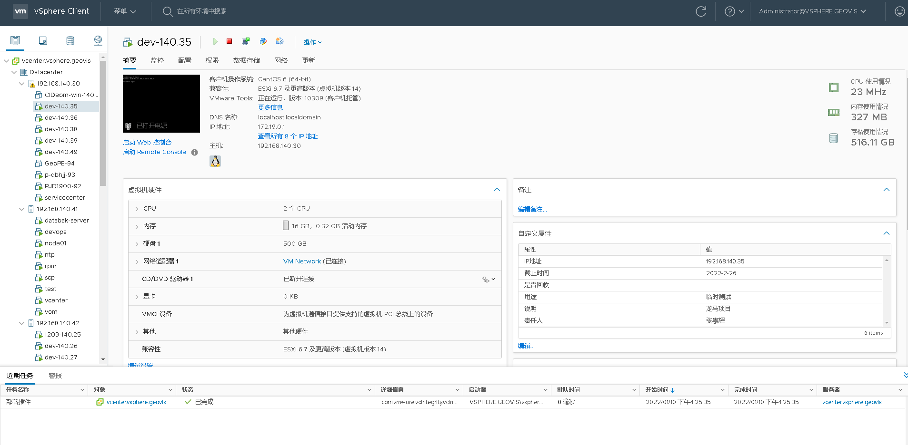

### 搭建 openstack

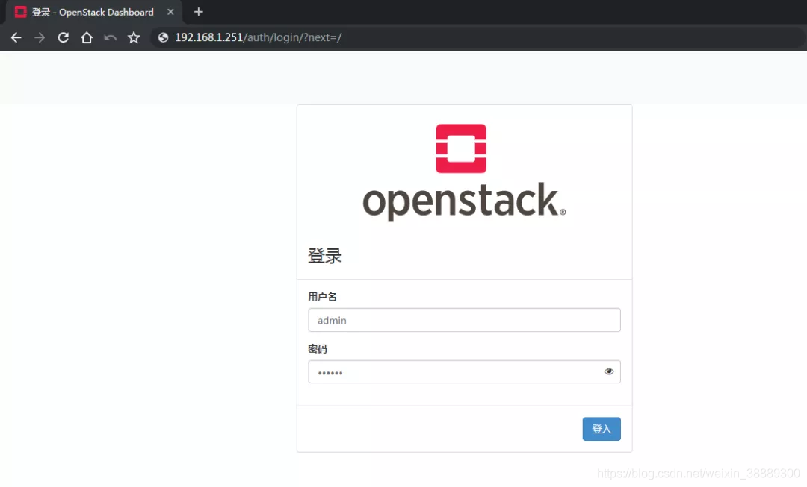

### 搭建 kubernets

### 搭建 gitlab

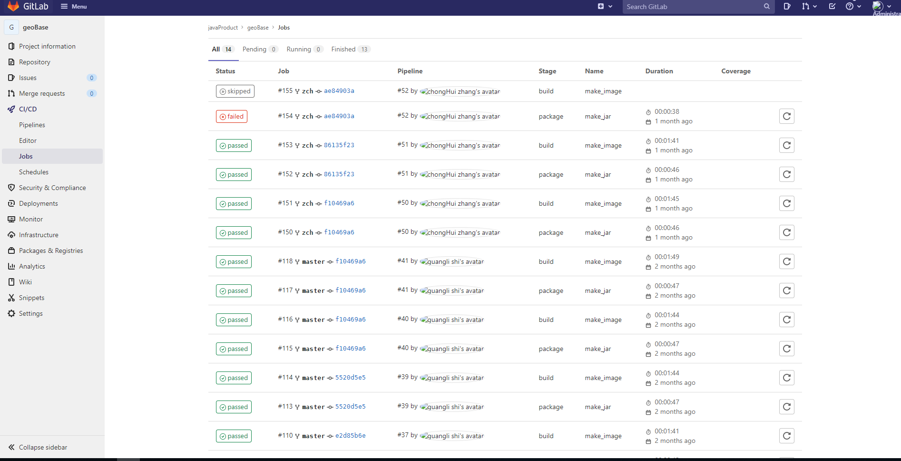

### 搭建 nexus

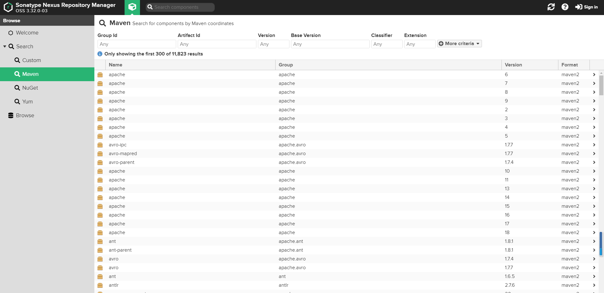

### 搭建 habor

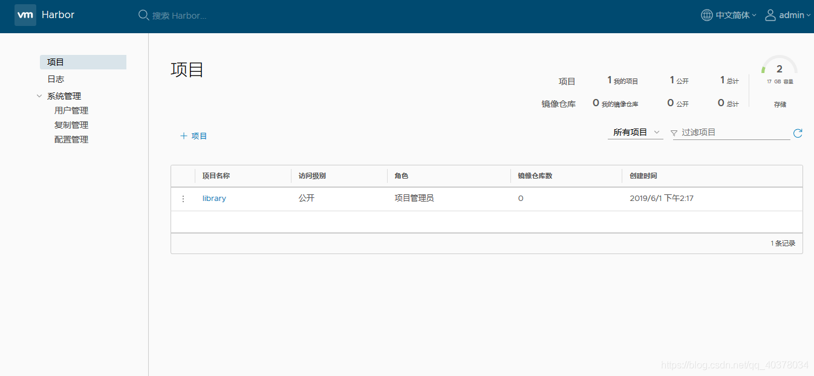

### 搭建 jenkins

### 搭建 监控系统

**Prometheus、grafana**

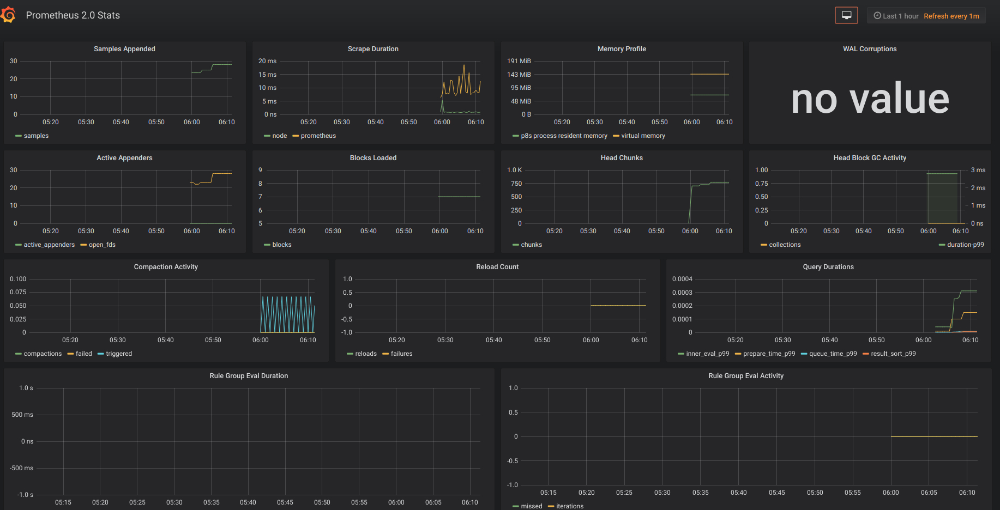

**zabbix**

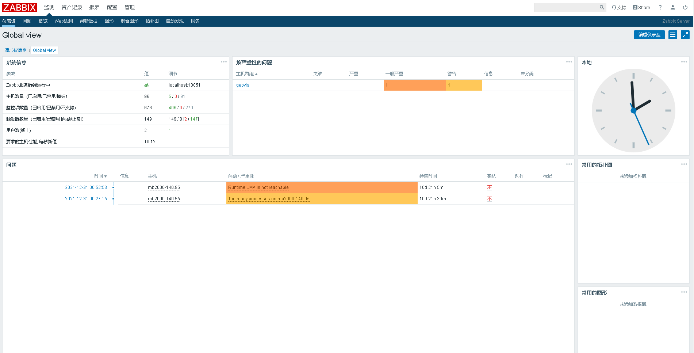

**VMware vRealize**

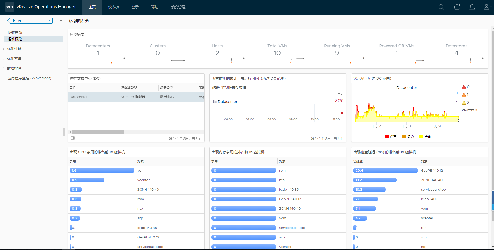

------

## 三、数字地球特色系列

------

### 数字地球

此部分内容话题敏感，故只做简单预览介绍。

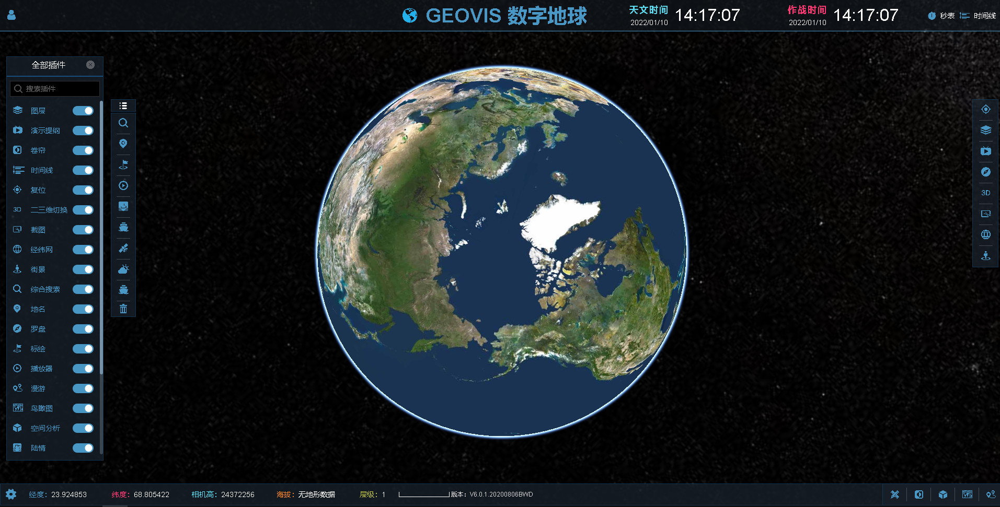

### 态势系统

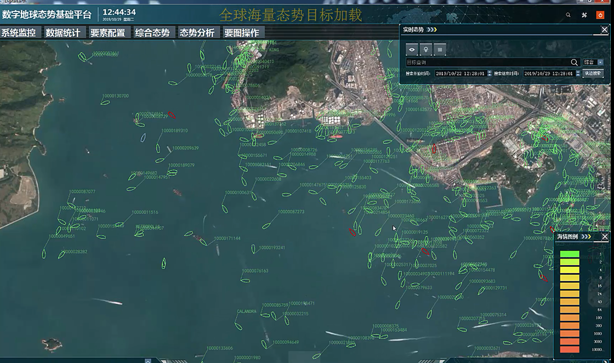

### 目标系统

### 情报系统

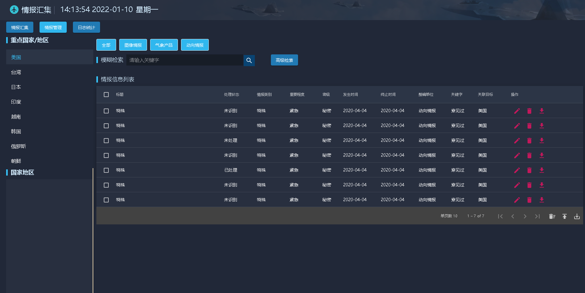

------

## 四、互联网电商及传统项目

------

### 寺库电商平台

**1、描述**

寺库（SECOO）致力打造全球奢侈品服务平台的多元化集团，总部设于北京。主要业务涉及奢侈品网上销售、奢侈品实体体验会所、奢侈品鉴定、养护服务等主营业务。寺库（SECOO）拥有国内最[专业](https://baike.baidu.com/item/专业/33053)[奢侈品](https://baike.baidu.com/item/奢侈品/1297)[鉴定](https://baike.baidu.com/item/鉴定/2444199)[团队](https://baike.baidu.com/item/团队/5384828)，全球最大的奢侈品养护工厂及遍布全球的多家奢侈品库会所，会所遍布北京、上海、成都、香港、东京、纽约、米兰、马来西亚中心地段，打造最具实力的全球领先奢侈品一站式服务平台，追求高品质生活人士的交流平台。

**2、职责**

技术负责人，带领技术团队拓展`生活方式`新业务线。

**3、方法**

主流`java`系技术，springboot、rabbitmq、dobbo、mybatis、mysql、redis、elasticsearch等。

**4、结果**

带领团队3个月实现系统的第一版上线。

### 易拍全球电商平台

**1、描述**

易拍全球由[中航国际](https://baike.baidu.com/item/中航国际/3034746)投资控股，是大型央企麾下的文化创意品牌。通过在线竞拍和直接交易，帮助世界范围内的藏家与拍卖公司等实现跨国交易的全球古董艺术品在线交易平台。 自2011年4月上线以来，易拍全球实现了跨越式发展，业务范围已覆盖亚、欧、美、澳、非等五大洲，注册会员逾30万，其中包括遍布全球的商家、收藏家、美术馆及博物馆专业人士、建筑师、银行家、基金和金融从业者、高级俱乐部会员，收藏爱好者等，并与全球5000家拍卖公司及古董商、画廊建立了合作。

**2、职责**

电商平台后端服务开发，负责订单管理方面的维护和开发。

**3、方法**

主流`java`系技术，springcloud、rabbitmq、mybatis、mysql、redis、elasticsearch等。

**4、结果**

系统新功能准时上线，稳定运行。

### 都邦车险系统平台

**1、描述**

该项目是都邦保险的一个项目。项目采用maven构建，使用ssh技术开发。负责的是车险系统的开发，主要包括快速报价，精确报价，新客户投保和老客户投保等模块。

**2、职责**

项目经理，负责需求调研，任务分配以及后台开发。

**3、方法**

主流`java`系技术，struts2、hibernate、oracle、redis、elasticsearch等。

**4、结果**

在合同期限内准时完成系统交付及上线。

### 工程院专家库系统

**1、描述**

本项目是中国工程院的一个项目。项目使用ssh+oracle的架构设计，其中用到了一些爬虫的技术，从网页抓取一些信息。由于现在项目涉及一些保密性，故在此只做简单介绍。

**2、职责**

负责核心代码编写，负责需求调研，带领团队完成合同。

**3、方法**

主流`java`系技术，springboot、oracle、redis、mongodb等。

**4、结果**

在合同期限内准时完成系统交付及上线。

### 建行设备管理系统

**1、描述**

该项目是中国建设银行的一个系统。系统主要包括安全预警、安全检查、合同管理、重点部位管理、安保装备管理等模块。该系统实现安全检查信息录入、安全预警的发布、年度报表、季度报表、以及实时生成报表等功能。

**2、职责**

主要负责项目安全预警、码表以及需求调研、任务分配。

**3、方法**

主流`java`系技术，springmvc、mybatis、mysql、redis等。

**4、结果**

在合同期限内准时完成系统交付及上线。

### 国航营销管理系统

**描述**

该项目是中国国际航空公司的一个系统。系统有营销机构信息管理模块、销售单位信息管理模块、预算管理模块、折让管理模块、兑现支付管理模块、预算监控管理模块六大模块构成。该系统是国航销售费用管理的一个系统。

**职责**

主要负责项目中所有涉及工作流的模块及部分模块编写。

**方法**

主流`java`系技术，struts2、mybatis、oracle、redis等。

**结果**

在合同期限内准时完成系统交付及上线。

------

## 五、项目管理

------

​	在企业项目管理过程中，可以概括为5个阶段和3个重点，一个完整的项目流程主要分为以下几步：**项目启动阶段，规划阶段，执行阶段，监控阶段，收尾阶段；**重点需要关注的内容为：**质量管理，进度管理，成本管理。**

### 项目启动阶段

首先，企业需要有确定的目标，这个目标要可执行、可拆解甚至可衡量，输入初始状态的企业，输出符合目标描述的企业，每个项目都要有明确的目标。 项目启动包括发起项目、命名项目、定义项目的广泛计划，同时也会根据项目的限制、风险、参与情况来确定目标。此外，也会根据项目可进行研究结果，以确定其可行性。

第一，澄清项目目标，找准项目背后的问题所在；

第二，找准项目干系人，特别是潜在的支持者和反对者，团结一切可以团结的力量；

第三，风险评估，结合公司内外部的环境，做出风险预案。

### 项目规划阶段

项目规划阶段包括确定**工作任务，任务分解，安排优先级，预算成本和风险管理**。

项目计划和控制是项目管理的主线，贯穿项目管理的全过程。为了使一个项目成功任务，必须有一个良好的计划与控制。任务分解就是项目管理中的WBS原则：从项目目标开始分解，逐层下降，每下降一层，代表对项目工作的更详细的定义，将任务分解到不能再分为止。

成本管理是为了保证完成项目的实际成本、费用不超过预算成本、费用的管理过程。项目成本=任务执行成本+管理成本。它包括资源的配置，成本、费用的预算以及费用的控制等项工作。风险管理则涉及项目可能遇到各种不确定因素。它包括风险识别，风险量化，制订对策和风险控制等。

在规划阶段需要制定一个全面的并且可以指导团队贯穿项目执行和终止等各个阶段的操作路线图，还要在关键的节点设定截止日期。此外，还要做好资源的分配。  

将任务分解为更小且易于管理的活动，可以更轻松地管理风险、成本、质量、时间进度等。 同时，任务的有效分解将使每个参与者在预算范围内能够按时完成项目。

第一，组建项目的核心小组，成员要能满足项目对于经验、技能和资源的要求。

第二，完成任务分解，跟据“横向到边，纵向到底”的原则，使项目的颗粒度足够分解到个人或小组可完成、可测量的程度。

第三，设置进度安排，为各项任务设定责任人、完成时间并匹配所需资源。特别提醒注意的是，项目经理要有从公司外部整合资源（人及财物），以及适当“外包”项目工作的意识，要有超越公司边界的全局意识。

### 项目执行阶段

执行阶段是项目管理的关键点，因为它将帮助每个人确定他们的努力是否最终会有成效。简单来说，就是通过执行来证明最终的结果到底如何。在执行管理中最重要的沟通管理，成员之间的有效沟通，是为了确保项目的信息的合理收集和传输所需要实施的一系列措施，它包括沟通规划，信息传输和进度报告等。

第一，带好团队，通过基于事和基于人的方式对团队进行激励；

第二，管理项目进度，通过会议、文档及相关的项目管理工作，使项目有序推进；

第三，处理好沟通协作的问题，特别是跨部门、跨部门的沟通问题，争取让各方都能在协作中实现各自价值。这里我想特别提醒一下，协作的基础是价值共享，项目经理要争取让协作各方能够获得或物质、或荣誉、或情感上的回报，这样的协作关系才持久。

### 项目监控阶段

监控项目工作是跟踪、审查和报告项目进展，以实现项目管理计划中确定的绩效目标的过程。最常用的就是用甘特图监控项目进度。也有一些企业需要统计工时等来做员工绩效考核的，视情况而定。

项目的监测和控制与项目执行会同时发生。 根据计划，项目经理的职责是监督运营并确保一切都朝着正确的方向发展。 

除了监督项目的绩效外，项目经理还必须监控资源、管理风险，同时负责相关的会议和对应的阶段性报告等工作。如果出现无法预料的问题，项目经理必须要对计划内容和时间表进行调整。

第一，识别计划的偏离，判断变化影响的是任务还是目标，因势而变。

第二，用好控制工作，包括费用表、人员负载量表等，使项目资源与项目进度相匹配。

第三，设定并管理项目的里程碑，通过不断实现“小”的胜利，来实现项目“大”的成功。

为了能确保项目计划的顺利实施，必须实时对项目的方方面面进行监控和评估，并及时作出必要的调整。其中几个主要的监控方面为：

1. 实时跟踪项目的整体进度，掌握可能导致项目延期的情况，及时对进度表进行调整以保持正常运行

2. 监控相关方需求的变化、市场的变化，并及时处理变更

3. 监控资源使用和成本使用，确保资源合理分配，及时维护成本基准

4. 监控沟通效果，确保成员之间、成员和相关方之间的沟通是高效的
5. 监控风险并识别新的风险，对风险管理及时作出更新，评估风险管理的效果

### 项目收尾阶段

项目管理的最后阶段并不是简单写一份报告或者给一份数据那么简单，项目经理必须记录所有可交付的成果，并将项目移交给负责监督其运营的客户或其他团队。  

不仅如此，团队成员还可以聚在一起召开最后一次会议，讨论一下自己的所学所得，并对有突出贡献的员工予以嘉奖。

第一，总结汇报，通过有效的形式呈现项目成果，并做完整交付。

第二，项目复盘，要深入分析项目目标、项目里程碑与最终成果之间的差距，分析得失，固化经验。

第三，项目知识管理，不单单是资料留存，更重要的是知识流转和应用。

### 项目质量管理

质量是项目成功的基础，质量管理包含质量计划、质量保证与质量控制等内容。

### 项目进度管理

进度管理是保证项目能够按期完成的重要基础。在项目整体大计划的前提下，各参人员或团队按照目标要求进行计划分解，并确保有效执行，不能因为某个节点出现问题而影响整体进度，这样才能保证项目的顺利进行。

### 项目成本管理

成本管理是保证项目在批准的预算范围内完成项目的过程，包括制定资源分配计划、成本估算、确定项目预算以及成本控制。

------

## 六、团建建设

------

### 团队构成

对于一个团队而言，确认团队的组织架构应该是第一要务，组织架构取决于公司的业务性质和经营导向。对于研发团队而言，主要有三种：产品型、技能型、混合型。

1、产品型

就是将做同一个产品的人员组织到一个团队中。这种组织架构的优点在于同个项目目标的人员处在同一个部门，能够便于大家在产品开发过程中的交流，实现更快的产品交付。但其缺点就是不利于相同技能方向的团队成员之间的互相学习和进步；甚至会造成很多研发资源的浪费，比如重复开发一些公共模块。产品型组织架构适合新市场快速验证迭代。

2、技能型

当公司发展有多个项目和模块功能开发，产品型组织架构就不适合了。我们需将不同技能的人员组织到一个团队中，这种组织架构的优点在于团队中专业化程度高，领域专家集中，容易产出更专业的公共/私有业务模块，也更利于团队成员的个人发展与进步，能够充分利用好开发资源。但其缺点就是不同部门合作开发产品时，若不注重对接工作流程建设，容易造成时间成本的提高，延长项目的开发周期。

3、混合型

随着公司的成长，发展到多条事业线，采用混合型研发组织架构较为适合。

每个事业线有自己独立的研发部，而集团总部有共用的研发如有技术平台部、系统质量部、大数据部等。这样的优点，各个事业线研发支撑、开拓更能独立自主灵活，缺点是争夺总部共用研发支撑资源，反应效率会缓慢。

### 团队协作

- 使用`seafile`搭建企业级私有云盘
- 使用`禅道`实现项目管理，测试管理
- 使用`gitlab`实现研发协作

### 团队管理

**希望管理**

- 宏伟现实的组织愿景
- 良好的组织梯队，晋升机会
- 树立身边的榜样，不吝鼓励
- 善于创造机会，或争取机会
- 传达公司或上层的好消息、好资讯，鼓舞士气   

**沟通管理**

建立很好的汇报机制，包括进度、风险、问题

- 上线内容预告
- 上线结果通知

- 线上问题汇报和管理（记录、复盘、追责）

- 进度风险预警

- 里程碑设置及汇报

- 项目结项、成果呈现汇报

- 新人日报、日常周报

建立很好的向下传达、周知机制

- 例会通报

- 邮件周知，抄送规则

**绩效管理**

-   团队目标制定
-    团队成员目标拆解与制定
-    组织绩效自评、考核、排名
-   绩效面谈

**`OKR`管理法**

`OKR`(Objectives and Key Results) 全称「目标和关键成果」，是一套明确和跟踪目标及其完成情况的管理工具和方法，制定可行性的`OKR`至少满足两点：

1. 遵循SMART原则
2. 遵循五四原则

SMART原则5个字母分别代表：

> Specific（具体的）
> Measurable（可衡量的）
> Attainable（可实现的）
> Relevant（相关的）
> Time-Based（有时间限制的）

也就是说我们从上到下分解拆分的KR是一个具体可衡量，与之相关，并有一定时限的可实现目标。

**五四原则指：不超过5个目标（O），每个目标（O）不超过4个KR（关键结果）**。

`OKR`强调的是聚焦目标，如果我们O或KR过多自己都会不清楚自己的目标或者关键结果，尤其是KR，一开始会把自己任务都一起写进KR中去，造成工作重点跑偏。

通过**SMART**和**五四原则**梳理后的`OKR`，才会更有可执行性。

**一些实施建议**

1. 聚焦关键目标结果，less is more
2. `OKR`需要有挑战，不要和绩效挂钩，否则和`KPI`没有差别了
3. 实时跟踪目标进度，避免目标进度走偏
4. 自上而下兼顾自下而上，有来自管理层层分解出来的目标（O），也有来下级自己制定的KR（关键结果）

**文档管理**

- 团队`wiki`搭建

- 需求、管理机制、测试环境、工具、入门文档
- 新人入职例行事宜、线上问题、分享`ppt`
- 文档积累列入`KPI`考核

**差异化管理**

**1、对不同能力和经验的人**

对有工作能力、有工作经验、善动脑子的人，能够采用以成果管理为主的方式方法。

在目标、任务一定的情况下，让这些人自己选取措施、方法和方式，自己控制自己的行为过程。

对工作能力较弱、工作经验较少、想法较少的人，能够采用以过程管理为主的方式方法，用规程、制度、纪律等控制这些人的行为过程，或者用传帮带的方式方法使这些人渐渐积累工作经验、提升工作能力。

在积分量化管理中，既对工作过程进行管理，又对结果进行考核。在工作过程中，员工做的每一件事或者是有好的表现，都可以获得积分奖励。

例如，员工积极向管理者汇报工作进度、配合团队协作，积极沟通工作等都可以有奖分。

到任务截止时间时，再根据任务完成情况给予员工奖扣分，任务按时完成会有奖分，提前完成还会有额外的奖分，而超时完成则会扣分，做到在整个工作过程中对员工的表现进行认可，肯定员工的工作价值。

**2、对能力强、态度差的能人**

中国有句家喻户晓的名言：“忠言逆耳利于行，良药苦口利于病”，然而在我们平时的工作和生活中，想必许多人都会发现，自己苦口婆心提出的批评意见，对方却很少买账。

直接给建议容易被对方抵制，他们也有权这么做。人们有权自己决定自己做什么，不做什么。

提供负面反馈时，请专注于问题的相关信息，让对方决定该怎么做。“你的衬衫露出来了”比“把你的衬衫塞好”要好。“我听不见”比“说高点”要好。

对待这一种两头冒尖的人，第一是用长处，长处展现出来了，弱点便被克制，也容易能够得到克服。第二是进行思想上和情感沟通的工作。

多交流，认可成绩、指出问题、沟通感情，使这些人倍感领导的关心和理解，也就会在工作中尽心尽职。

再者是放开一点，采取一忍二等的办法。不要老是盯着他，而是给他留有一定余地。

能力很强的人应采取多调几个岗位的办法，既能够让他们多方面发挥更大的作用，又可以调动他们乐于奉献、多出成绩的积极性。

运用积分管理，通过积分量化考核员工的个人能力和综合表现，并用软件记录起来，管理者通过软件对这些数据进行分析，可以了解到每位员工的优势和不足，并充分发挥员工的优势，让员工负责他擅长的部分工作。同时可以用奖分鼓励员工多发表自己的想法，员工提出合理化的建议，参与话题讨论，会议发言等都可以获得奖分。

管理者和员工之间双向沟通，多了解员工的真实想法，体现对员工的关怀和尊重，员工也会更积极的对待工作。

**3、对缺陷型员工**

员工的工作中有过失，只要这种过失没有造成很大后果，性质也不严重，领导者可以装作“不知”，不予过问，这样做是为了避免损伤员工的自尊心，领导者不要急于结算他过去的过失，给他一次将功补过的机会。

任正非认为，员工都是在犯错中成长，对于由于经验不足犯错的员工要宽容，鼓励大家改进工作。

思想不经磨炼就容易钝化。那种善于动脑筋的人，就越来越聪明。他们也许以身尝试，惹些小毛病，各级领导要区分他们是为了改进工作而惹的病呢？

还是责任心不强而犯下的错误？是前者，你们要手下留情。我们要鼓励员工去改进工作。

积分量化管理允许员工犯错，员工在工作中有失误的地方，有不直接损害企业的利益，都是用积分银行软件扣积分的方式向员工传递信号，让员工在信号下改正错误。

管理者不需要出面去批评，就可以达到让员工改正错误的目的。

用扣分的方式，员工也更容易接受，避免管理者因为批评员工而让彼此陷入难堪的境地，让员工和管理者之间的关系更加和谐。

